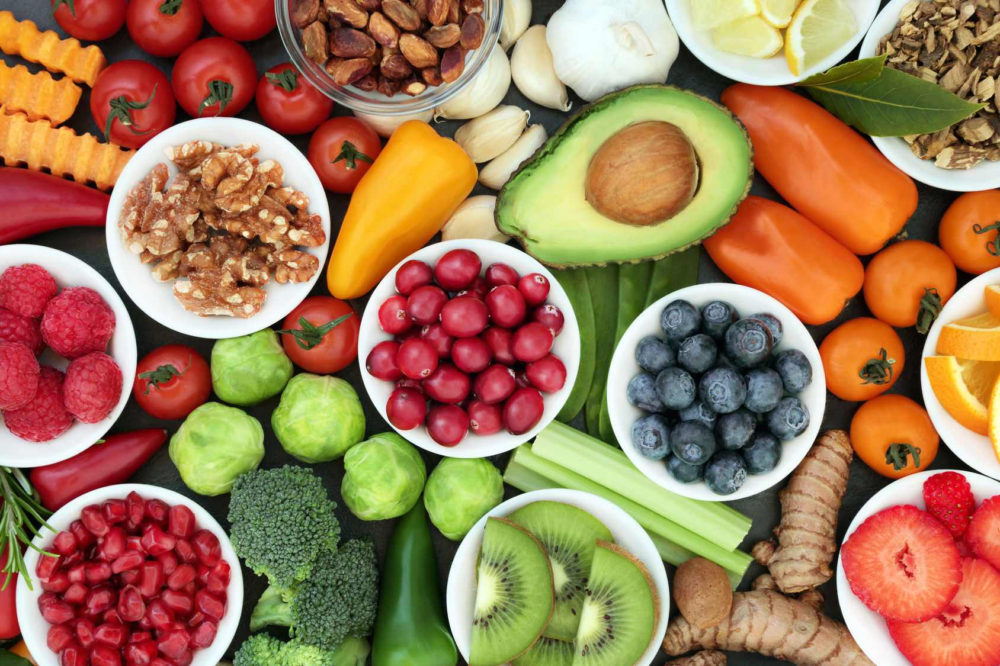

# Food Detection and Calorie Estimation  
Deep Learning project

---

# Team

Petar Kirilov, 8MI0600153  
Milen Valev, 0MI0600178  
Asen Krasimirov, 2MI0600231  
Kaloyan Petkov, 0MI0400122  

---

# Idea

The project develops an image-based system for **automatic food recognition** and **calorie estimation**.

- Identify food items on a plate (e.g., apples, bananas, pizza)  
- Estimate calorie values based on predefined nutritional tables  
- Applications in mobile health, fitness, and dietary monitoring  

---

# Food Detection Model

- Use pre-trained **CNN-based classifiers**  
- Datasets: [Food-101](https://www.kaggle.com/datasets/dansbecker/food-101) or custom annotated datasets  
- Output: Class labels for detected food items

---

# Calorie Estimation Module

- Map detected food types to caloric values using a **nutritional database**  
- Estimate portions via image size ratio estimation  
- Output: Total estimated calories per image  

---

# Data

Potential datasets:  
- Food-101  
- UEC-Food100 / UEC-Food256  
- Manually annotated calorie metadata  

Data preprocessing:  
- Annotation of food classes  
- Normalization and augmentation  
- Mapping food classes to calorie entries  

---

---

# Technologies

- Python  
- PyTorch  
- Convolutional Neural Networks  
- Pretrained models: ResNet, EfficientNet, YOLOv5  
- Nutrition APIs or databases (e.g., USDA FoodData Central)

---

# Difficulties

- Food item occlusion or overlapping in images  
- Ambiguity in food types (e.g., pasta varieties)  
- Calorie estimation without exact portion size  
- Image lighting and angle variation

---

# Relevant papers

- [Improved food image](https://www.nature.com/articles/s41598-025-95770-9)  
- [Deep learning-based automatic food identification](https://link.springer.com/article/10.1007/s11042-025-20648-x)  
- [Automatic Food Recognition Using Deep Convolutional Neural Networks](https://link.springer.com/article/10.1007/s44230-023-00057-9)

---

# Thank you!
